# GitHub Copilot  

## セキュリティ

**関連リンク**
[GitHub Copilotセキュリティセンター](https://copilot.github.trust.page/?trust_center=github-copilot-trust-center)

### サードパーティテスト、認証

| 認証種類 | レベル | 対象 | 概要 |
|---------|--------|------|------|
| **SOC 1** | Type 2 | 全般 | 顧客の財務諸表に重要な影響を与えるセキュリティ統制の監査。組織のシステムとプロセスの統制有効性を証明 |
| **SOC 2** | Type 1 | Copilot Business専用 | セキュリティサービス保護に必要な統制が整備されていることを実証。ポイントインタイム（特定時点）での統制設計の有効性を評価 |
| **SOC 2** | Type 2 | Copilot Business & Enterprise | 一定期間（2024年4月〜9月）における統制運用の有効性を実証。米国SaaS企業のセキュリティコンプライアンスのゴールドスタンダード |
| **ISO/IEC 27001** | 2013 | Copilot Business & Enterprise | 情報セキュリティマネジメントシステムの国際標準。GitHubの他製品と同じセキュリティプロセスと標準で開発・運用されていることを実証（2024年5月9日更新） |
| **CSA CAIQ** | Level 1 | 全般 | Cloud Security Alliance CAIQ自己評価。クラウドセキュリティに関する業界標準の評価フレームワーク |
| **CSA STAR** | Level 2 | 全般 | Cloud Security Alliance STAR認証。より高度なクラウドセキュリティ認証レベル |

NDAに基づいて、Enterpriseユーザーに、実行されたサードパーティの侵入テストおよびアプリケーションテストのレポートを提供できる。

### 暗号化

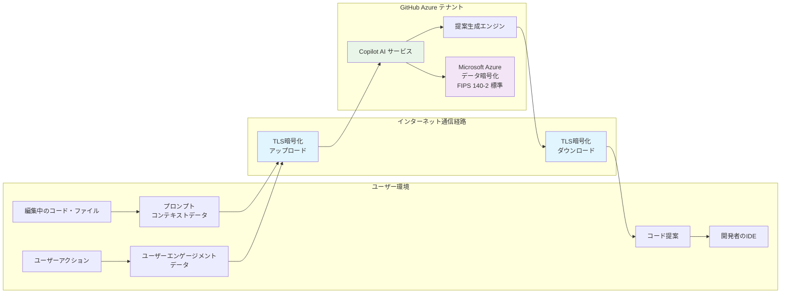

- ユーザーエンゲージメントデータ：商人または却下されたコード補完、エラーメッセージ、システムログ、メトリクスなど
  ユーザーエンゲージメントデータは24ヶ月保存されている
  アクセスが厳重に制御される。データ二アクセスできるのは指定されたGitHubまたはMicrosoft社員のみ
- プロンプト：チャットまたはコードの入力とコンテキスト。提案を生成するためにCopilotのAIに送信されるデータ
  レスポンスを返すために十分な時間のみ維持され、その後破棄される。すべての処理は一時的でメモリ内で実行される
- コード提案：プロンプトに基づいてユーザーに提供されるAIが生成したコードまたはチャット応答

## プロセスフロー

### インバウンド


- コードエディタから送信
  ユーザーが入力したプロンプトはHTTPS経由で安全に送信される  
  
  Copilotは次のコンテキストを収集する  
  - カーソル位置前後のコード
  - プロンプトの直近のコンテキストを理解する
  - 編集するファイルのファイル名と種類
  - ファイルの種類に合わせたコード提案ができる
  - 隣接するファイルタブの情報
  - プロジェクト構造とファイルパス
  - プログラム言語とフレームワークに関する情報
  - Fill-in-the-Middle手法を使用する前処理
  - テキストの一部を空欄（マスク）にして、その空欄部分をモデルに予測させる学習方法
  前処理では、元のテキストを3つの部分（前文、空欄、後文）に分割し、空欄部分をマスクトークンなどで置き換える
  これにより、モデルは文脈を理解しながら空欄を埋める能力を学習する

- プロキシフィルター
  プロンプトはGitHub所有のAzureテナントでホストされているプロキシサーバーに渡される  
  このプロキシでフィルター処理されるので、プロンプトハッキングなどの攻撃が防止される

- 有害性フィルタリング
  生成されたコードに以下のようなものが含まれないようにする
  - ヘイトスピーチと不適切なコンテンツ
  - 個人データ
    - 名前、住所、ID番号などの個人データを積極的に除外
  
### アウトバウンド


- 後処理と応答の検証
  LLMによって生成された応答に有害なコンテンツがある場合は有害性フィルターによって削除される
  プロキシサーバーで最終チェックを行うことで、コードの品質、セキュリティ、倫理観が担保される  
  - コードの品質
    - 一般的なバグや脆弱性、XSSやSQLInjectionがないか
    - 一般公開されているコードとの一致を除外

## プラン

**関連リンク**
[プラン](https://docs.github.com/ja/copilot/get-started/plans)
[Enterprise 向けプランを選ぶ](https://docs.github.com/ja/copilot/get-started/achieve-company-goals)

GitHub Copilotには以下の5つのプランがある  

| プラン             | 対象ユーザー         | 主な特徴                                   | 管理機能         | 料金         | 選定基準（おすすめの人）                |
|--------------------|---------------------|--------------------------------------------|------------------|------------------------------|----------------------------------------|
| Copilot Free       | 個人                | 基本的なコード補完・チャット機能           | ×                | 無料                         | Copilotを試してみたい初心者・学習者      |
| Copilot Pro        | 個人                | 高度な補完・チャット・拡張機能              | ×                | 月額 $10                   | 日常的に開発を行う個人開発者・フリーランス |
| Copilot Pro+       | 個人                | Proの全機能＋Vision・エージェント           | ×                | 月額 $39                   | 画像解析やAIエージェント機能も活用したい個人 |
| Copilot Business   | 組織・企業          | 組織管理・ポリシー・高度なセキュリティ      | ○                | 月額 $19/ユーザー           | チーム・組織で管理機能やセキュリティが必要な場合 |
| Copilot Enterprise | 大企業・組織        | Businessの全機能＋監査ログ・高度な管理      | ◎（監査ログ等）  | 月額 $39/ユーザー           | 監査・高度な管理・大規模運用が必要な企業      |

上位プランに変更する理由  
Free→Pro  コード補完の回数制限がなくなる、Claude Sonnet4やGemini 2.5Proなどの高性能モデルが使用できるので日常的にコーディングでCopilotを使用したい人
Pro→Pro+  Premiumリクエスト数の増加、o3やClaude Opus4などの高性能モデルが使用できるので、更に多くCopilotを使用したい、エージェントモードなども使用したい人
Business→Enterprise　コンテンツフィルター、監査ログ、優先サポート、ナレッジベースが使用できるので、企業でコンプライアンスが重要な場合

## ベストプラクティス

**関連リンク**
[ベストプラクティス](https://docs.github.com/ja/copilot/get-started/best-practices)

- 使い分け
  - 得意なこと
    - テスト・繰り返しコードの記述
    - デバッグと構文修正
    - コード説明・コメント作成
    - 正規表現作成
  - 苦手なこと
    - コーディング以外の質問
    - 専門知識の学習

- ツール選択
  - コード補完
    - コードスニペット補完
    - 繰り返しコード記述
    - コメントからコード生成
  - Copilot Chat
    - コードに関する質問・回答
    - 大きなコードブロック生成
    - 特定の役割でのタスク実行

- プロンプトエンジニアリング
  - 4つのS  
    - Simple（単一）：常に、明確に定義された 1 つのタスクまたは質問に集中する
    - Specific（具体的）：明確かつ詳細にする
    - Short（短く）：簡潔かつ要点を得たものにする
    - Surround（周囲環境）：わかりやすいファイル名、関連ファイルを開いたままにする
  - 単一かつ短い指示の例：「指定されたリストから偶数をフィルター処理して返す Python 関数を作成してください」
  - ソースコードの先頭にコメントを追加して、求めている応答についてより多くの詳細を提供すると良い  
  - コメントには学習用の例を追加すると良い  
  - アサートと反復  
    一回の応答で必ずしも完璧なコードが得られるとは限らない  
    求めているものではない場合は対話の１ステップと捉えて詳細と例を追加して再度プロンプトを入力する  

## ソフトウェア開発ライフサイクルに合わせた適用

**関連リンク**
[AIツール](https://docs.github.com/ja/copilot/concepts/ai-tools
)

1. 計画
   プロジェクトの目標、スコープ、要件を定義する  
   短い自然言語か画像からCopilotによって構造化されたissueを生成  
   対処するissueを選び、ブレインストーミングし、必要なツールライブラリ、リソースについて学ぶ
   - `Copilot Chat`アイデアを追跡するためのisueを作成
   - `Copilot Chat`でブレインストーミングを行って適切なテクノロジを特定
2. コード作成
   機能を実装し、バグを修正し、コードベースに反復処理を行うことでプロジェクトを完成する  
   Askモードでは、ペアプログラマとしてコーディングタスクの支援、難しい概念の理解、コード改善ができる
   Editモードでは、Copilotが変更できるファイルを選び、Copilotにコンテキストを提供し、提案された編集を受け入れるかどうかを決定する  
   Agentモードでは、反復タスクの自動化、ワークフローの直接管理の支援、バックグラウンドでのテストやリンターの実行ができる
   - `コード補完`でコード入力を最適化
   - `Copilot Chat`で開発環境内の質問に応答し、提案を提供
   - 未解決のissueに`コーディングエージェント`を割り当て、必要な変更に対処するためのプルリクエストを作成
3. レビュー
   コードの品質と信頼性を確保する  
   変更の分析、潜在的なissueの特定、他のユーザーからのフィードバックを受ける準備ができたら、プルリクエストにCopilotをレビュー担当者として割り当てることで、人によるレビューの前にコード品質を改善んし、潜在的なバグを特定する  
   - `Copilotコードレビュー`でIDEまたはプルリクエストレビューとしてフィードバックを提供
4. テスト
   配置前にバグを検出し、機能を確保し、コード品質を維持するためのテストを作成して実行する
   - `Copilot Chat`でテストの作成とデバッグを提供
5. 展開
   運用環境用のコードを準備し、リリースをスムーズに行う  
   配置スクリプトの構成、CI/CDパイプラインの設定、issueトラブルシューティング  
   - `Copilot Chat`でCI/CDパイプラインの構成
6. 運用
   運用中の保守と監視に充填を置く  
   運用上のissueのデバッグ、パフォーマンスの最適化、システム信頼性の確保  
   - 未解決のissueに`コーディングエージェント`を割り当て、必要な変更に対処するためのプルリクエストを作成

## GitHub Copilotの機能  

**関連リンク**
[プラン](https://docs.github.com/ja/copilot/get-started/plans)
[機能](https://docs.github.com/ja/copilot/get-started/features)

- エージェント機能
  - Copilot コーディングエージェント：課題やコードの修正を自動的に実行し、ドラフトプルリクエストを作成するAIエージェント機能。
  - エージェントモード：Copilotをより自律的な作業パートナーとして動作させ、複数のステップを実行可能なモード。
  - Copilot コードレビュー：プルリクエストに対し自動でコードレビューコメントや改善提案を生成する機能。
  - GitHub Copilot Extensions：外部ツールの機能を GitHub Copilot Chat に統合する機能。

- チャット機能（Copilot Chat）
  - IDE内チャット機能：コードに関する質問をチャット形式で行い、応答を得ることができる。
  - インラインチャット：コード行間から直接対話形式で補完や説明を得られる機能。
  - スラッシュコマンド：チャット内でスラッシュコマンド形式により特定の操作（テスト生成等）を実行可能。
  - モバイルおよび他インターフェース対応：GitHub Mobile や Windows Terminal 内でも Copilot Chat が利用可能。

- モデルアクセス
  - チャットで使用可能な生成モデル：GPT-4.1、GPT-4o、o3、o4-mini、各種Claude、Gemini など、多様な最新モデルにプランに応じてアクセス可能。

- コード補完機能
  - コードの提案：コード入力中に即座に提案が得られる。
  - 次の編集候補：次に編集される位置に対して最適なコードを提案する流れ型補完機能。

- カスタマイズ機能
  - カスタム命令：特定プロジェクトやユーザーに合わせた Copilot の指示を設定可能。Organizationのカスタム命令はプレビュー機能。
  - プロンプトファイル：再利用可能なプロンプトをファイルとして定義・呼び出しできる機能。
  - プライベート拡張機能：自作の拡張機能を組み込んで Copilot を拡張可能。
  - コーディングガイドラインの適用：自動補完やレビュー時に組織のコーディング規約を反映可能。
  - パブリックコード一致提案のブロック：公開リポジトリと同じコードが提示されるのを防ぐ機能。
  - ファイル除外設定：特定のファイルを補完対象から除外可能（例：機密ファイルなど）。
  - Organization単位でのポリシー管理：組織レベルで Copilot 各種設定を制御できる（Enterprise 向け）。

- その他の機能
  - プルリクエストの要約：生成AIがプルリクエスト内容の概要を自動生成。
  - CLIによる利用：コマンドラインインターフェースから Copilot を操作可能。
  - Copilot サポート技術情報：公式サポートチームによる技術支援とナレッジベースへのアクセス。
  - Copilot Spaces：コード、ドキュメント、仕様などの関連するコンテンツを一元管理することで、特定のタスクに沿ったコンテキストで Copilot の回答を得ることができる機能。
  - GitHub Spark：Web アプリの自然言語による生成支援を行う Spark 機能。

- 管理機能
  - ポリシー管理：組織または企業で Copilot のポリシーを管理する機能。
  - アクセス管理：企業所有者がCopilotを使用できる組織メンバーを指定する機能
  - 使用状況データ：企業または組織内のCopilot使用状況データを確認、アクセスを管理する機能。
  - 監査ログ：Copilot 利用時の操作や設定変更履歴の記録機能（Enterprise 向け）。
  - コンテンツ除外：特定のコンテンツを Copilot の補完・生成対象から除外する設定。

## 機能詳細

### コードの提案/次の編集候補

**関連リンク**
[コード提案](https://docs.github.com/ja/copilot/concepts/completions/code-suggestions)
[コードの提案を取得する](https://docs.github.com/ja/copilot/how-tos/get-code-suggestions/get-code-suggestions)
[Copilotのコード参照](https://docs.github.com/ja/copilot/concepts/completions/code-referencing)
[候補に一致するパブリック コードの検索](https://docs.github.com/ja/copilot/how-tos/get-code-suggestions/find-matching-code)

| Free | Pro | Pro+ | Business | Enterprise |
|-|-|-|-|-|
| ◯ [^1] | ◯ | ◯ | ◯ | ◯ |

[^1]: コードの提案は1か月あたり2,000回まで

- コードの提案
  - 入力中にリアルタイムにコードを提案する
  - `Tab`を押すと提案を受け入れる。`Alt+]またはAlt+[`を押すと次の提案を表示する
    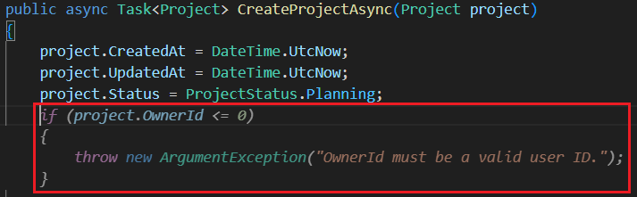
  - 提案にマウスカーソルをおいて表示される`単語を採用する`を押すと現在選択中の単語のみを適用する
  - 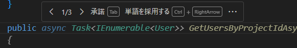
- 次の編集候補
  - 現在編集中の内容に基づいて、次に行う可能性のある編集の場所を予測、補完を提案する

コードの提案に使用されるモデルはデフォルtおではgpt-4o Copilotモデルだが、VS Codeで代替モデルが使用できる場合はモデルを変更できる。  
設定でパブリックコードと一致する候補を許可している場合、提案されるコードの中にはパブリックコードに一致するコードを提案する可能性がある。その場合は提案と同時にそのコードの詳細を表示するリンクが表示される。  

### テキスト入力候補

**関連リンク**
[テキスト入力候補](https://docs.github.com/ja/copilot/concepts/completions/text-completion)
[PRの説明を記述する](https://docs.github.com/ja/copilot/how-tos/get-code-suggestions/write-pr-descriptions)
[PR概要を作成する](https://docs.github.com/ja/copilot/how-tos/use-copilot-for-common-tasks/create-a-pr-summary)

| Free | Pro | Pro+ | Business | Enterprise |
|-|-|-|-|-|
| ✕ | ✕ | ✕ | ✕ | ◯ |

GitHubでプルリクエストを作成し、説明を入力するとプルリクエストに含まれるコンテキストに基づいて説明を提案する

### チャット

**関連リンク**
[チャット](https://docs.github.com/ja/copilot/concepts/chat)

| Free | Pro | Pro+ | Business | Enterprise |
|-|-|-|-|-|
| ◯ | ◯ | ◯ | ◯ | ◯ |

AIモデルと対話して、コーディング支援、説明、提案を会話形式で取得する。  
GitHub上、IDE上、GitHub Mobile上で使用できる。  
Copilot Chatに[カスタム指示](#カスタムインストラクション)を追加できる。

### コーディングエージェント

**関連リンク**
[コーディングエージェント](https://docs.github.com/ja/copilot/concepts/coding-agent/coding-agent)
[Copilotを使用してissueを処理する](https://docs.github.com/ja/copilot/how-tos/use-copilot-agents/coding-agent/assign-copilot-to-an-issue)

| Free | Pro | Pro+ | Business | Enterprise |
|-|-|-|-|-|
| ✕ | ◯ | ◯ | ◯ | ◯ |

独立して動作し、人間と同じようにタスクを遂行することができる。  
コーディングエージェントとエージェントモードは異なる。  

- コーディングエージェント：GitHub Actionsで自律的に機能して割り当てられたタスクを実行してプルリクエストを作成する。
- エージェントモード：Copilot Edits機能の一部で、IDE上で自律的にコードの編集を行うことができる。

#### コーディングエージェントでできること  

- バグの修正
- 増分型の新機能を実装する
- テストのカバレッジを向上させる
- ドキュメントを更新する
- 技術的負債に対処する

#### 使い方

- issueにCopilotを割り当てる
  - GitHub上でissueページを開き、対象のissueのAssigneesにCopilotを選択する
  - issueを割り当てるとタイトル、説明、コメントが送信されるが、割当て後に追加されたコメントは認識しない
  - Copilotがタスクを完了して作成したプルリクエストにコメントを追加することで追加の作業を依頼できる
  - Copilotがissueを認識すると 👀 の応答を残してタスクを開始し、数秒後にプルリクエストが作成される
- GitHubのAgentsページからプルリクエストを作成するように依頼する
  - GitHubのAgentsページから対象のリポジトリを選択して、変更を依頼するプロンプトを入力する
- VSCodeの`GitHub Pull Requests拡張機能`をインストールし、Copilot Chatから`#copilotCodingAgent`を追加したプロンプトを送信する
- GitHub MCPサーバーからプルリクエストを作成するように依頼する
  - リモートのGitHub MCPサーバーを使用して任意のMCPホストからプルリクエストを作成するように依頼する
- セッションの追跡
  - GitHubのAgentsページにリポジトリ全体のエージェントのセッションの概要が表示される
  - VSCodeの拡張機能からエージェントのセッションを追跡することもできる

#### 利点

ブランチの作成、コミットメッセージの作成とプッシュ、プルリクエストの作成、説明の記述が自動化できる。  
IDE上でインラインやChatを通してCopilotを使用した場合は、途中経過は追跡されないが、コーディングエージェントを通してCopilotを使用した場合は、すべてのやりとりがプルリクエストワークフローの一部として実行されるため、チーム全体にコラボレーションを導入できる。

#### エージェントのセキュリティ

- Enterprise/Organizationに設定されているセキュリティポリシーに従う
- インターネットアクセスが制御されたサンドボックス環境で動作し、リポジトリに対して読み取り専用アクセスを持つ
  - リポジトリの設定で`Custom allowlist`の設定を行うことで任意のドメイン、URLに対してのインターネットアクセスを許可することができる
- `copilot/`で始まるブランチのみを作成、プッシュできる
- 書き込みアクセス許可を持たないユーザーからの指示は受け付けない

#### 注意事項

Copilot コーディングエージェンには以下の制限、注意事項がある

- GitHub ホステッドランナーでのみ動作し、セルフホステッド GitHub Actions ランナーで動作しない
- 内容の除外（コンテンツフィルター）が考慮されず、対象のファイルを表示、更新できる
- パブリックコードと一致する提案のブロックは考慮されない

### コードレビュー

**関連リンク**
[コードレビュー](https://docs.github.com/ja/copilot/concepts/code-review/code-review)
[コード レビューの使用](https://docs.github.com/ja/copilot/how-tos/use-copilot-agents/request-a-code-review/use-code-review)
[自動コード レビューを構成する](https://docs.github.com/ja/copilot/how-tos/use-copilot-agents/request-a-code-review/configure-automatic-review)
[コーディングガイドラインを構成する](https://docs.github.com/ja/copilot/how-tos/use-copilot-agents/request-a-code-review/configure-coding-guidelines)

| Free | Pro | Pro+ | Business | Enterprise |
|-|-|-|-|-|
| △ [^2] | ◯ | ◯ | ◯ | ◯ |

[^2]: VSCode の [Review selection] のみ

以下の3つの方法でコードレビューを行うことができる。  

- プルリクエストにCopilotをレビュー担当者として割り当てる
  - `Automatic Copilot code review`オプションを有効化することでプルリクエストが作成されたときに自動でレビューするようにもできる。
- VSCode内でコードを範囲選択し、レビューを依頼する
  - レビューするコードを選択 > Command Paletteから`GitHub Copilot: Review and Comment`を選択
- VSCode内でコミットされていないすべての変更に対してレビューを依頼する
  - VSCodeのソース管理からコードレビューのボタンを押す

カスタムインストラクションを作成している場合はCopilotのレビューで参照される。  

### MCP

**関連リンク**
[MCPについて](https://docs.github.com/ja/copilot/concepts/about-mcp)

### 内容の除外（コンテンツフィルター）

**関連リンク**
[コンテンツ除外](https://docs.github.com/ja/copilot/concepts/content-exclusion)
[GitHub Copilot からのコンテンツの除外](https://docs.github.com/ja/copilot/how-tos/configure-content-exclusion/exclude-content-from-copilot)

| Free | Pro | Pro+ | Business | Enterprise |
|-|-|-|-|-|
| ✕ | ✕ | ✕ | ◯ | ◯ |

特定のファイルを無視するようにCopilotを構成できる。  
コンテンツ除外を設定すると、クライアントは現在のリポジトリURLをGitHubサーバーに送信し、サーバーが正しいポリシーをクライアントに返すことで適用される。  

- コンテンツ除外ポリシー
  機密情報や特定のコードをCopilotの学習から除外するため、特定のファイルパスやリポジトリからのコンテンツをCopilotの提案から除外できる  
  - 設定可能な除外パターン
    - ファイルパスベース
      - 特定のディレクトリ全体（/secrets/*）
      - ファイル拡張子（*.key）
      - 特定のファイル名（*password*）
    - リポジトリレベル
      - `リポジトリ名/*`
    - 組織内の特定のリポジトリを除外
      - `組織名/リポジトリ名/*`
    - 除外の適用範囲
      - 学習データから除外
      - 提案生成からの除外
    - 設定できる人
      Enterprise管理者、Organization管理者、リポジトリ管理者が設定可能  
      Enterprise -> Organization -> リポジトリの順に設定が継承される  
      上位の設定は下位で書き換えることはできない  
    - 設定方法
      - `Settings > Code And automation > Copilot`

### ナレッジベース

**関連リンク**
[ナレッジベース](https://docs.github.com/ja/copilot/concepts/knowledge-bases)
[ナレッジ ベースの作成と管理](https://docs.github.com/ja/copilot/how-tos/provide-context/create-knowledge-bases)

| Free | Pro | Pro+ | Business | Enterprise |
|-|-|-|-|-|
| ✕ | ✕ | ✕ | ✕ | ◯ |

1つまたは複数のリポジトリにまたがるサポート技術情報を作成できる。  
サポート技術情報はGitHub外で管理しているMarkdownファイルを指定することができる。  
GitHub、VSCode、VSのChatでOrganizationsメンバーは、ナレッジベースをコンテキストとして指定できる。  
ナレッジベースを指定してChatで質問すると、Copilotはナレッジベースで関連情報を検索して応答を作成する。  

- 設定方法
  - `Settings > Your organizations > Copilot > Knowledge bases`
  - ナレッジベースの作成ページで名前、説明、対象リポジトリを選択

### ポリシー

**関連リンク**
[ポリシー](https://docs.github.com/ja/copilot/concepts/policies)
[組織での Copilot のポリシーと機能の管理](https://docs.github.com/ja/copilot/how-tos/administer-copilot/manage-for-organization/manage-policies)
[ポリシーの競合](https://docs.github.com/ja/copilot/reference/policy-conflicts)

| Free | Pro | Pro+ | Business | Enterprise |
|-|-|-|-|-|
| ✕ | ✕ | ✕ | ◯ | ◯ |

自分のorganizationのメンバーにライセンスを割り当てるときに、そのライセンスで使用できる機能を制御できる。  
Enterprise -> Organization の順に設定が継承される  
設定できるポリシーは以下の通り。

- 機能ポリシー：Copilotの機能を使用できるかどうか（GitHubでCopilotを使用するかなど）
- プライバシーポリシー：気密性のアクションが許可されるかどうか（パブリックコードと一致する提案をするかなど）
- モデルポリシー：基本モデルの範囲外のモデルを使用できるかどうか（Claude Sonnet 3.5 を使うかなど）

- 設定方法
  - `Settings > Your organizations > Code, planning, and automation > Copilot > Policies`
  - `Settings > Your organizations > Code, planning, and automation > Copilot > Models`

**ポリシーの競合**
Enterpriseの所有者が`No policy`を選択した場合、Organizationの所有者にポリシーの設定が委任される。  
Organization1では許可、Organization2では拒否を設定することが可能で、1と2両方の組織にライセンスを付与されているユーザーも存在する。  
ポリシーが設定可能な機能ごとにライセンスが付与されているいずれか1つのOrganizationで許可されている場合は、すべてのOrganizationで機能が利用可能なものと、1つでも拒否されているとすべてのOrganizationで機能が利用不可能なものが存在する。

### 機能強化

#### カスタムインストラクション

**関連リンク**
[回答のカスタマイズ](https://docs.github.com/ja/copilot/concepts/response-customization)
[リポジトリカスタム命令](https://docs.github.com/ja/copilot/how-tos/configure-custom-instructions/add-repository-instructions)
[個人用カスタム命令](https://docs.github.com/ja/copilot/how-tos/configure-custom-instructions/add-personal-instructions)

- リポジトリ命令：リポジトリのコンテキストで質問されるすべてのプロンプトに、定義した命令が自動で含まれる。
- 個人用命令：ユーザーが受け取るすべてのチャット回答が好みに合わせて調整されるように個人用命令を追加できる。

設定

- チャットで常に参照される指示ファイル
- プロジェクトの概要、目的、背景情報、重要なディレクトリやファイル、プロジェクトのフォルダ構造、命名規則、書式設定、ベストプラクティス、コーディング基準、プロジェクトで使用するツール、ライブラリ、フレームワークおよびそのバージョンなどを記述することを推奨
- 以下の機能に適用される
  - VS Code、Visual Studio、JetBrains IDE、Xcode、GitHub Web サイトでの Copilot チャット
  - Copilot コーディング エージェント
  - Copilot コード レビュー

- 使い方
  - カスタムインストラクションファイルを作成して設定
    - Copilot チャットの設定ボタンから、指示の生成を選択で初期ファイルを作る  
      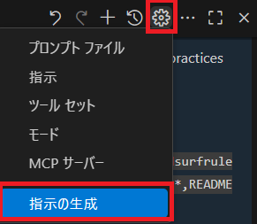  
    - プロジェクトに1つのカスタムインストラクションファイルを適用する場合  
      - `.github/copilot-instructions.md`のファイルを作成する  
    - プロジェクトに複数のカスタムインストラクションファイルを適用する場合  
      - `.github/instructions`フォルダを作成し、`*.instructions.md`ファイルを作成する  
      - glob構文を使用してカスタムインストラクションを適用する対象を指定できる  

        ```code
        ---
        applyTo: "app/models/**/*.rb"
        ---
        ```

  - GitHub上から設定
    - Copilotボタン > Personal instructions
      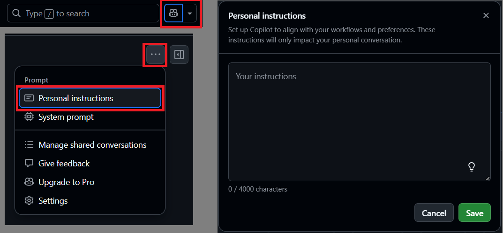

- おすすめ設定
  - 応答を作成するときに外部リソースを参照するという要求（例：microsoft/promptyのリポジトリの情報から答えてください）
  - 特定のスタイルで回答するという指示（例：親しみやすい友達のように答えてください）
  - 常に特定の詳細レベルで応答するという要求（例：100文字以内で回答してください）
  - その他[awesome-copilot](https://github.com/github/awesome-copilot)でもサンプルが公開されている

#### メンション（エージェント）

関連するコンテキストをプロンプトに含める  
チャットに@を入力することでメンションの候補を表示する  

- @workspace  
  現在開いているファイル、プロジェクト、構成の情報を活用して、ワークスペース全体をコンテキストに含める
- @terminal  
  ターミナル、CLI関連の操作について問い合わせる  
- @vscode
  Visual Studio Codeの操作や設定について問い合わせる
- @github
  GitHubのリポジトリ操作やワークフローについて問い合わせる

#### スラッシュコマンド

一般的なシナリオで複雑なプロンプトの入力をしなくて済むようになる  

- /doc
  特定のプログラムにのドキュメントコメントを作成する
  ファイル、プログラムをコンテキストに含めてdocを実行するとドキュメントコメントを作成してくれる  
  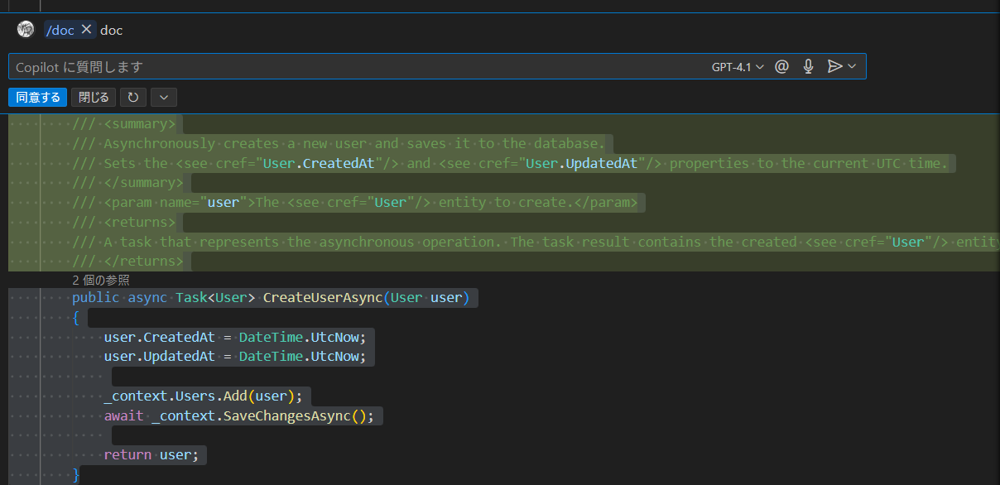  
- /explain
  特定のプログラムについて解説する
  ファイル、プログラムをコンテキストに含めてexplainを実行すると内容を解説してくれる  
  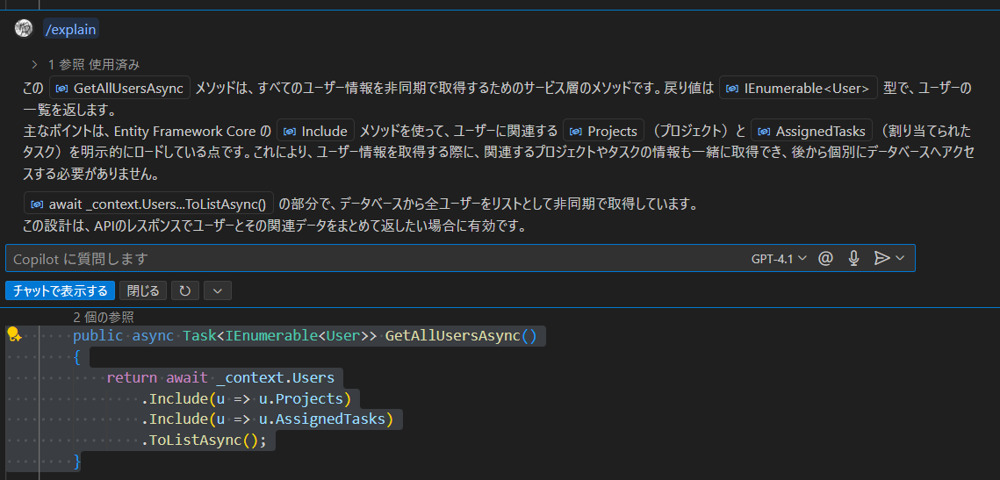  
- /fix
  特定のプログラムのバグを解消する
  ファイル、プログラムをコンテキストに含めてfixを実行するとバグがある場合は改善案を提示してくれる  
  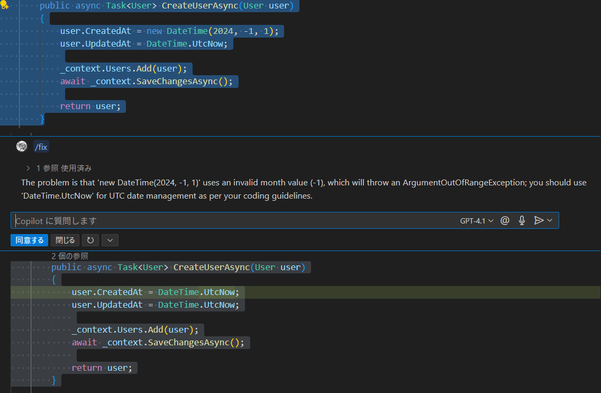  
- /generate
- /tests
  特定のプログラムのテストを作成してもらう  
  ファイル、プログラムをコンテキストに含めてtestsを実行するとテストを作成してくれる  
  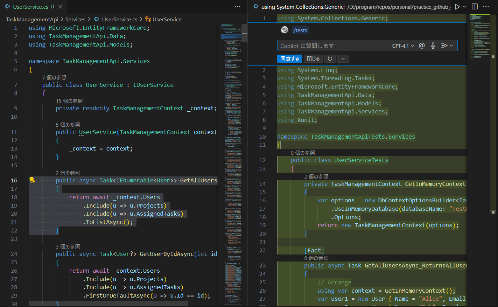  
  
## コンテキストウィンドウ

### コンテキストウィンドウの制限

  提案を生成するためにモデルで同時に処理可能な、周囲のコードおよびテキストの量  
  通常約200～500行のコードおよびテキスト  

## Copilot Vision

  GitHub Copilotに対して画像で指示が可能になる機能  

- 使い方
  - Copilot チャットに画像を貼り付けて、画像に応じたプロンプトを入力する
  
- 主な用途
  - ラフで書いた画面イメージから画面のプログラムコードを生成  

      
      
    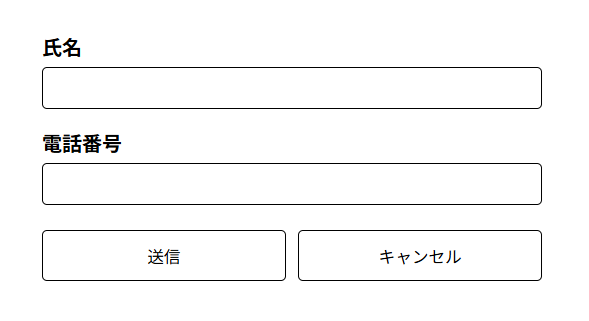  

  - エラーの診断、デバッグ  
    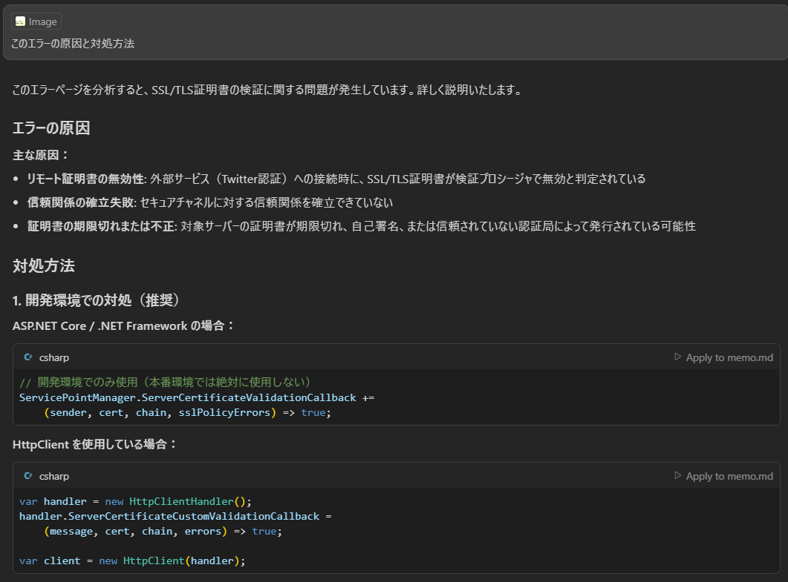  
  - コードレビュー  
  - ドキュメント生成  
  - CSSのスタイル崩れの調査、修正  

## GitHub Copilot CLI

GitHub CLIおよびCopilot拡張機能をインストールすることで使用可能  
以下の機能がある  

- `gh copilot explain` コマンドの説明をしてもらう
- `gh copilot suggest` コマンドを提案してもらう
  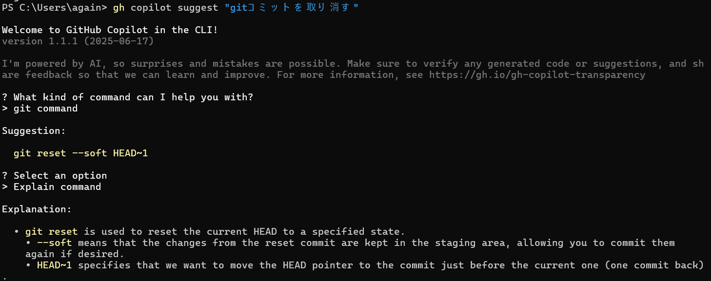
- `gh copilot alias` コマンドのエイリアスを設定する

## Copilotのポリシー設定（オプトアウト）

Copilotによるデータ収集や利用について、ユーザーが自ら拒否の意思を示す設定ができる  
以下の設定が可能  

- プロンプト、補完のトレーニング利用拒否
  プロンプトとして入力した内容や、コード補完がAIのモデルに利用されないようにする設定
  Business、Enterpriseではデフォルトで使用しない設定になっている
  個人向けFree/Pro/Pro+では
  `Settings > Copilot > Allow GitHub to use my data for product improvements` から変更可能
- パブリックコードと一致する提案のブロック
  公開リポジトリ上のコードと一致する提案を表示しないようにする設定
  Business、Enterpriseではデフォルトでブロックする設定になっている
  個人向けFree/Pro/Pro+では
  `Settings > Copilot > Suggestions matching public code` から変更可能
- コーディングエージェント設定
  Copilotコーディングエージェントの有効/無効/特定のリポジトリだけ有効の設定ができる
  個人向けFreeプランでは使用不可、個人向けPro以上のプランでは
  `Settings > Copilot > Repository access` から変更可能

## Copilot コード補完の留意事項

**関連リンク**
[コード補完の制限](https://docs.github.com/ja/copilot/responsible-use/copilot-code-completion#limitations-of-github-copilot-code-completion)

- 制限付きのスコープ：Copilotは大量のコードでトレーニングされているが、スコープが限られており、複雑なコードを処理できない場合がある。JavaScriptなどはパブリックリポジトリにデータが多くCopilotに最適化されている言語の一つであるが、パブリックリポジトリで表現が少ない言語は支援が最適でない場合がある。
- 潜在的バイアス：トレーニングデータは既存のリポジトリから取得されており、バイアスとエラーが含まれていることがある。また、特定の言語かコーディングスタイルに偏っている可能性がある。
- セキュリティリスク：Copilotの提案は注意して扱わなければ機密情報や脆弱性の漏洩の可能性があり、常にレビューとテストを十分に行う必要がある。
- パブリックコードとの一致：確率は高くないが、トレーニングセット内のコードと一致するコード候補が提案される可能性がある。
- 法律と規制：AIサービスを利用する際に、該当する法律や規制上の義務を評価する必要がある。

## Tips

- 関連するファイル、型・モデルファイル、テストクラス（またはその逆）は必ず開いておく

## 管理者向け

