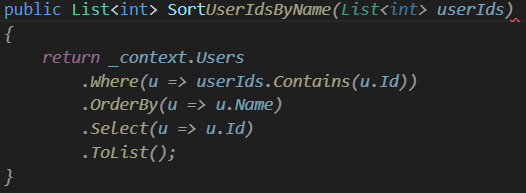

# GitHub Copilot概要  

## GitHub Copilotの機能  

- インライン サジェスチョン  
  - コードの入力中にリアルタイムで続きのコードをサジェストしてくれる
  - ファイル内の既存のコード、インポート、変数名、コメントなどから文脈を理解する  
  - 操作
    - Tab: 提案を受け入れる  
    - Esc: 提案を却下する  
    - Alt + ]: 次の提案を表示（複数の候補がある場合）  
    - Alt + [: 前の提案を表示  

      

- Copilot チャット
    チャットで質問、コードスニペット要求

- インライン チャット
    コードエディター内で直接会話
    Ctrl+I

- コメントをコードに変換

- 自動化されたテスト生成

## プロンプトエンジニアリング

- 4つのS  
  - Simple（単一）：常に、明確に定義された 1 つのタスクまたは質問に集中する
  - Specific（具体的）：明確かつ詳細にする
  - Short（短く）：簡潔かつ要点を得たものにする
  - Surround（周囲環境）：わかりやすいファイル名、関連ファイルを開いたままにする
  ---
  - 単一かつ短い指示の例：「指定されたリストから偶数をフィルター処理して返す Python 関数を作成してください」
  - ソースコードの先頭にコメントを追加して、求めている応答についてより多くの詳細を提供すると良い  
  - コメントには学習用の例を追加すると良い  

- アサートと反復  
  一回の応答で必ずしも完璧なコードが得られるとは限らない  
  求めているものではない場合は対話の１ステップと捉えて詳細と例を追加して再度プロンプトを入力する  

## プロセスフロー

### インバウンド


- コードエディタから送信
  ユーザーが入力したプロンプトはHTTPS経由で安全に送信される  
  
  Copilotは次のコンテキストを収集する  
  - カーソル位置前後のコード
  - プロンプトの直近のコンテキストを理解する
  - 編集するファイルのファイル名と種類
  - ファイルの種類に合わせたコード提案ができる
  - 隣接するファイルタブの情報
  - プロジェクト構造とファイルパス
  - プログラム言語とフレームワークに関する情報
  - Fill-in-the-Middle手法を使用する前処理
  - テキストの一部を空欄（マスク）にして、その空欄部分をモデルに予測させる学習方法
  前処理では、元のテキストを3つの部分（前文、空欄、後文）に分割し、空欄部分をマスクトークンなどで置き換える
  これにより、モデルは文脈を理解しながら空欄を埋める能力を学習する

- プロキシフィルター
  プロンプトはGitHub所有のAzureテナントでホストされているプロキシサーバーに渡される  
  このプロキシでフィルター処理されるので、プロンプトハッキングなどの攻撃が防止される

- 有害性フィルタリング
  生成されたコードに以下のようなものが含まれないようにする
  - ヘイトスピーチと不適切なコンテンツ
  - 個人データ
    - 名前、住所、ID番号などの個人データを積極的に除外
  
### アウトバウンド


- 後処理と応答の検証
  LLMによって生成された応答に有害なコンテンツがある場合は有害性フィルターによって削除される
  プロキシサーバーで最終チェックを行うことで、コードの品質、セキュリティ、倫理観が担保される  
  - コードの品質
    - 一般的なバグや脆弱性、XSSやSQLInjectionがないか
    - 一般公開されているコードとの一致を除外

## 機能強化

### メンション（エージェント）
  関連するコンテキストをプロンプトに含める  
  チャットに@を入力することでメンションの候補を表示する  
  - @workspace  
    現在開いているファイル、プロジェクト、構成の情報を活用して、ワークスペース全体をコンテキストに含める
  - @terminal 
    ターミナル、CLI関連の操作について問い合わせる  
  - @vscode
    Visual Studio Codeの操作や設定について問い合わせる
  - @github
    GitHubのリポジトリ操作やワークフローについて問い合わせる


### スラッシュコマンド
  一般的なシナリオで複雑なプロンプトの入力をしなくて済むようになる
  - /doc
    特定のプログラムにのドキュメントコメントを作成する 
    ファイル、プログラムをコンテキストに含めてdocを実行するとドキュメントコメントを作成してくれる  
      
  - /explain
    特定のプログラムについて解説する 
    ファイル、プログラムをコンテキストに含めてexplainを実行すると内容を解説してくれる  
      
  - /fix
    特定のプログラムのバグを解消する 
    ファイル、プログラムをコンテキストに含めてfixを実行するとバグがある場合は改善案を提示してくれる  
      
  - /generate
  - /tests
    特定のプログラムのテストを作成してもらう  
    ファイル、プログラムをコンテキストに含めてtestsを実行するとテストを作成してくれる  
      
  

## コンテキストウィンドウ

### コンテキストウィンドウの制限
  提案を生成するためにモデルで同時に処理可能な、周囲のコードおよびテキストの量  
  通常約200～500行のコードおよびテキスト  


## カスタムインストラクション
  **2025/7/27現在プレビュー機能のため、Businessプランの場合は組織で有効化されている必要がある**

  - チャットで常に参照される指示ファイル
  - プロジェクトの概要、目的、背景情報、重要なディレクトリやファイル、プロジェクトのフォルダ構造、命名規則、書式設定、ベストプラクティス、コーディング基準、プロジェクトで使用するツール、ライブラリ、フレームワークおよびそのバージョンなどを記述することを推奨
  - 以下の機能に適用される
    - VS Code、Visual Studio、JetBrains IDE、Xcode、GitHub Web サイトでの Copilot チャット
    - Copilot コーディング エージェント
    - Copilot コード レビュー

  - 使い方
    - Copilot チャットの設定ボタンから、指示の生成を選択で初期ファイルを作る  
        
  - プロジェクトに1つのカスタムインストラクションファイルを適用する場合  
    - `.github/copilot-instructions.md`のファイルを作成する  
  - プロジェクトに複数のカスタムインストラクションファイルを適用する場合  
    - `.github/instructions`フォルダを作成し、`*.instructions.md`ファイルを作成する  
    - glob構文を使用してカスタムインストラクションを適用する対象を指定できる  
      ```
      ---
      applyTo: "app/models/**/*.rb"
      ---
      ```
  - おすすめ設定
    - https://github.com/github/awesome-copilot

## Copilot Vision
  GitHub Copilotに対して画像で指示が可能になる機能  

  - 使い方
    - Copilot チャットに画像を貼り付けて、画像に応じたプロンプトを入力する
  
  - 主な用途
    - ラフで書いた画面イメージから画面のプログラムコードを生成  
      
        
        
        

    - エラーの診断、デバッグ  
        
    - コードレビュー  
    - ドキュメント生成  
    - CSSのスタイル崩れの調査、修正  


## Tips
  - 関連するファイル、型・モデルファイル、テストクラス（またはその逆）は必ず開いておく